## Installation

1. **Clone the repository:**
    ```bash
    git clone https://github.com/VishalChoudhary01/stock-treading.git
    cd tred-brains
    ```

2. **Install dependencies:**
    ```bash
    npm install
    ```

3. **Start the application:**
    ```bash
    npm run dev
    ```

4. Open your browser and navigate to `http://localhost:3000` to view the app.

---

## Dependencies Used

This project uses the following main dependencies:

- **@reduxjs/toolkit** and **react-redux**: For state management using Redux.
- **axios**: For making HTTP requests to APIs.
- **chart.js** and **react-chartjs-2**: For rendering interactive charts and graphs.
- **motion**: For animations and transitions.
- **nextjs**: The React framework for server-side rendering and routing.
- **react** and **react-dom**: The core libraries for building the user interface.
- **react-icons**: For including icon sets in the UI.

### Where They Are Used

- **Redux Toolkit & React Redux**: Used for managing for theme switcher the app.
- **Axios**: Used in API utility files and components to fetch stock data and other resources.
- **Chart.js & React Chartjs 2**: Used in dashboard and analytics components to display stock trends and data visualizations.
- **Motion**: Used in UI components for smooth animations and transitions.
- **Next.js**: Provides the app structure, routing, and server-side rendering.
- **React Icons**: Used in navigation bars, buttons, and other UI elements for visual icons.

### Dev Dependencies

- **ESLint & eslint-config-next**: For code linting and maintaining code quality.
- **Tailwind CSS**: For utility-first CSS styling.
- **@tailwindcss/postcss**: For integrating Tailwind CSS with PostCSS.

You can find all dependencies listed in the `package.json` file.

# Screenshots
## ***Desktop*** 
## Home Page ( Dark Mode)
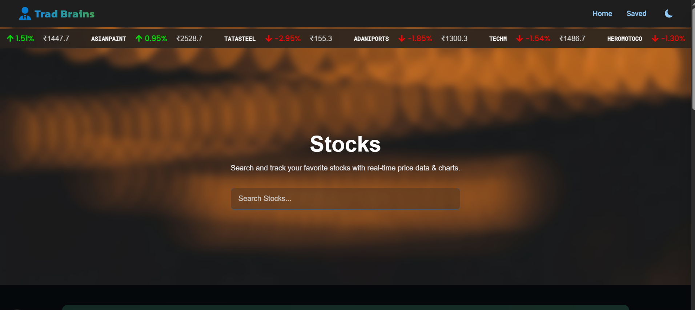

## Home Page ( Light Mode)
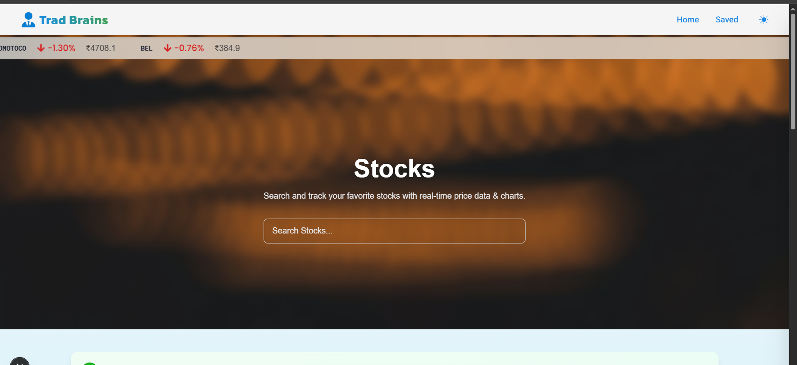

## Auto complete Search ( Dark Mode)
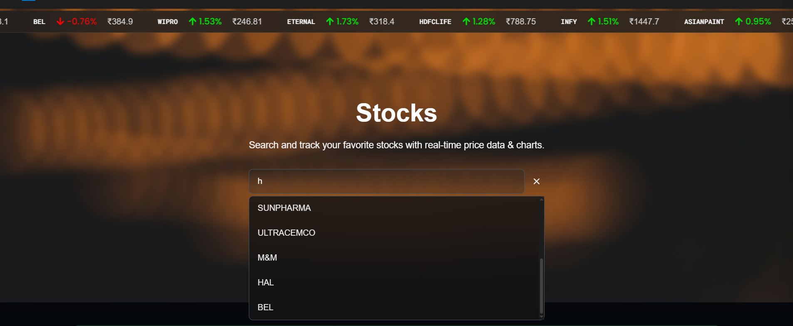

## Stocks Data ( Light Mode)
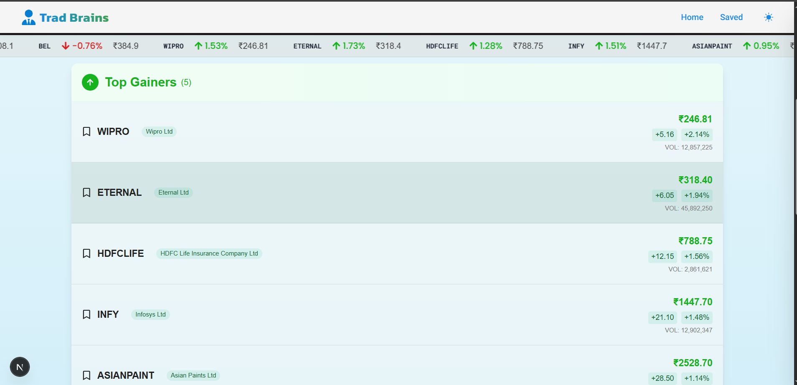

## Stocks Data ( Dark Mode)
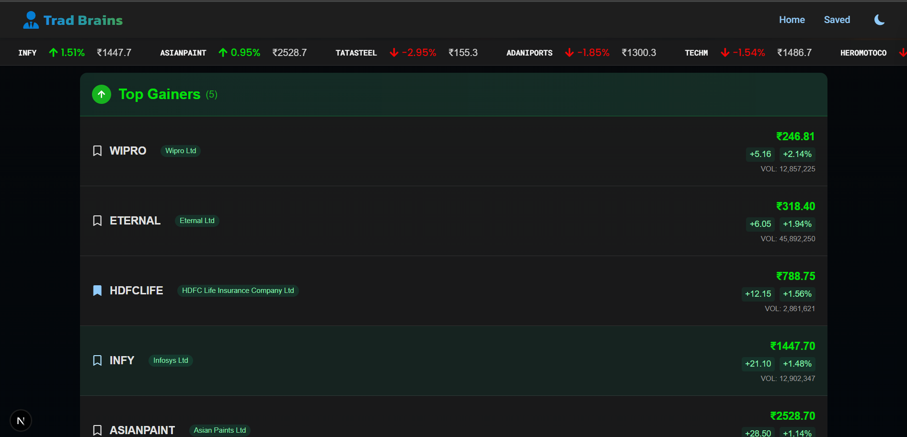

## Bookmark ( Dark Mode)
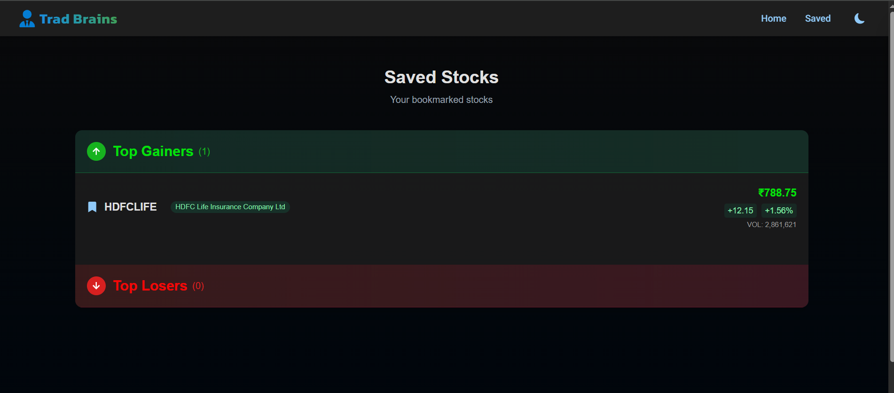

## Stock details & Chart ( Dark Mode)
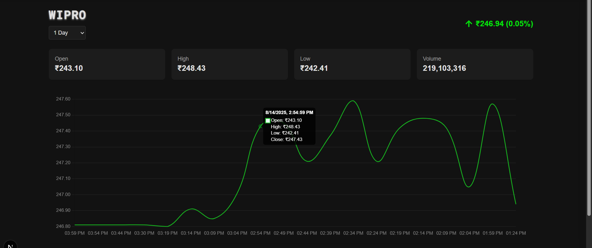

# ***Mobile***
## Home Page ( Dark Mode)
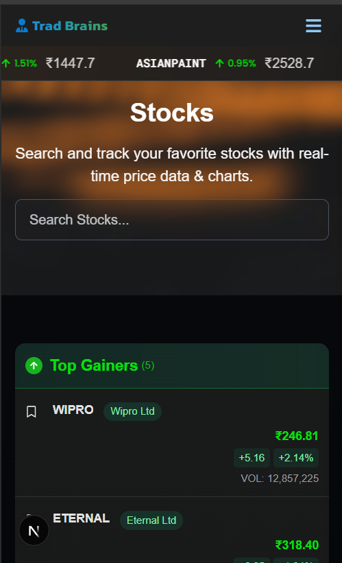

## Auto complete Search ( Dark Mode)
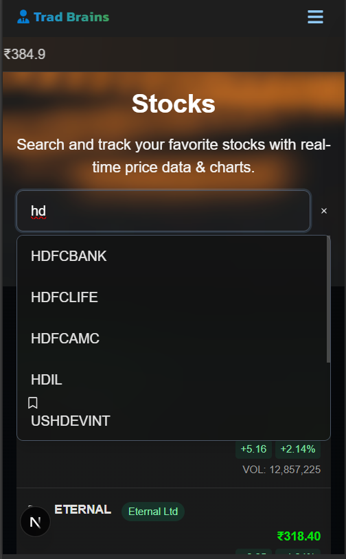

## Stock Detail with Chart ( Light Mode)
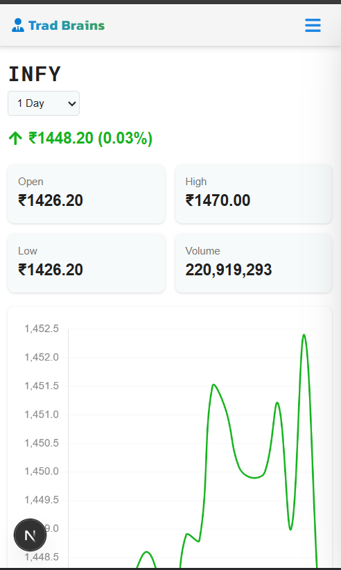

## Stock Detail with Chart ( Dark Mode)
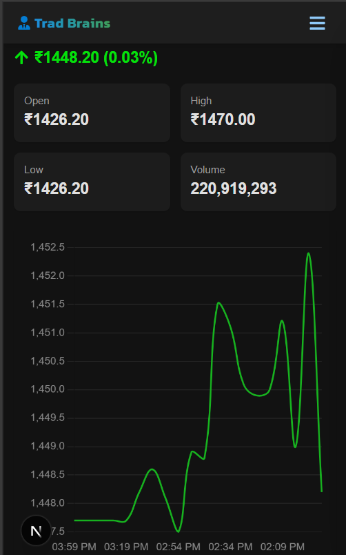

## Saved Stock ( Dark Mode)
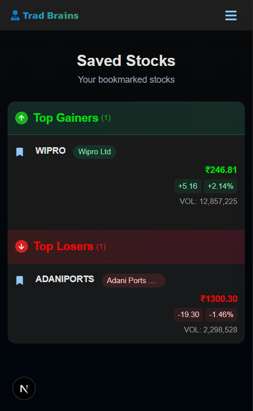


